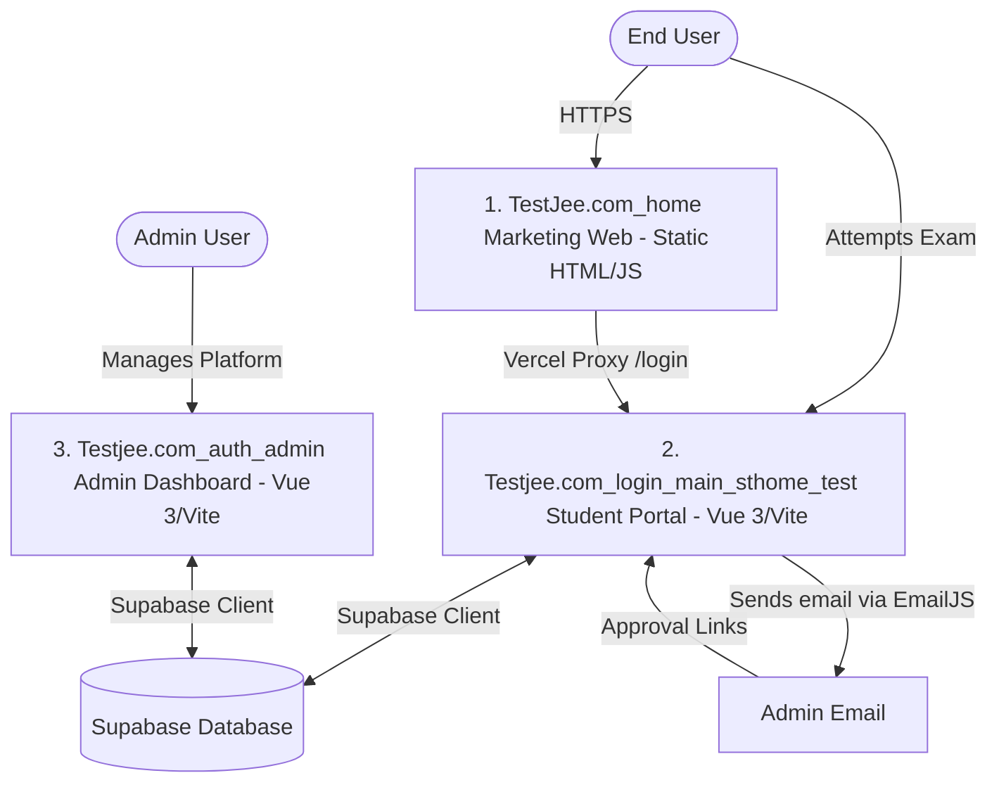

# TestJEE — Workspace Architecture & Understanding Report

This document outlines the detailed system architecture, explains how to run each component, addresses the development environment configurations, details the two distinct exam engines, and explains the proctoring, security, and multiple exam implementations (JEE, NEET, KCET).

---

## 1. System Architecture & Directory Breakdown

The repository is structured as a **Multi-Repository Monorepo Layout** consisting of three independent applications that communicate through a shared database (Supabase) and proxy configurations:



### 📂 Directory Details

| Directory Name | Tech Stack | Role & Purpose | Deployment Method |
| :--- | :--- | :--- | :--- |
| **[`TestJee.com_home`](file:///c:/Users/admin/Desktop/testjee/TestJee.com_home)** | HTML5, Vanilla JS, CSS (Tailwind via CDN), Service Worker | **Public Landing / Marketing Website**<br>Contains the pricing, contact details, features, and about pages. Represents the core `testjee.com` entry point. | Hosted on Vercel as a static site. |
| **[`Testjee.com_login_main_sthome_test`](file:///c:/Users/admin/Desktop/testjee/Testjee.com_login_main_sthome_test)** | Vue 3 (Composition API), Vite, Pinia, Vue Router, Tailwind, Supabase | **Student Portal & Live Exam Admin Controls**<br>Main interface where students log in, view dashboard, and attempt exams. Also hosts the admin panels for scheduled live sessions. | Hosted on Vercel (`login.testjee.com`). |
| **[`Testjee.com_auth_admin`](file:///c:/Users/admin/Desktop/testjee/Testjee.com_auth_admin)** | Vue 3, Vite, Pinia, Vue Router, Tailwind, Supabase | **Admin Dashboard**<br>Separate web application for the Gyan Edge administration to approve student signups, view student statistics, and manage test restore requests. | Hosted on Vercel on a private administrative URL. |

---

## 2. Dev Environment Diagnostics (Running Components Locally)

Here is how each component is configured and run locally:

### A. Project Root (`c:\Users\admin\Desktop\testjee`)
*   **Context:** There is **no root-level `package.json`**. The repository is not a formal npm workspace. Do not run `npm run dev` here. Run it within individual directories.

### B. Home Directory (`TestJee.com_home`)
*   **Context:** Pure static HTML/JS site without a build step or `package.json`.
*   **How to Run:** Use a local static file server:
    *   Node.js: `npx serve .`
    *   Python: `python -m http.server 8000`

### C. Admin Dashboard (`Testjee.com_auth_admin`)
*   **Context:** Contains Vite configuration and dependencies.
*   **How to Run:** Run `npm install` inside this folder first to populate `node_modules/`, then run `npm run dev`.

### D. Student Portal (`Testjee.com_login_main_sthome_test`)
*   **Context:** Dependencies are pre-installed.
*   **How to Run:** Run `npm run dev` inside this directory to start the Vite server on port `3000`.

---

## 3. The Vercel + Authentication Plumbing

*   **Vercel Proxying (`vercel.json`):**
    The main marketing site (`TestJee.com_home`) has a `vercel.json` file with proxy rewrites:
    ```json
    {
      "source": "/login/:path*",
      "destination": "https://testjee-com-xcqa.vercel.app/login/:path*"
    }
    ```
    This redirects any user visiting `testjee.com/login` behind the scenes to the student app, creating a unified single-domain feel.
    
*   **Admin Approval Flow (No Database Cheating):**
    1.  A student signs up via `Login.vue` on the Student Portal.
    2.  Instead of immediately writing data to Supabase (which would let unapproved users bypass controls), a structured email is sent to the admin via **EmailJS** containing a base64-encoded URL approval link:
        `https://www.testjee.com/admin-approve?name=...&email=...&pwd=<base64>&mobile=...`
    3.  When the admin clicks this, they are routed to the `/admin-approve` page which decodes the credentials and triggers the actual Supabase Auth signup (`signUpWithPassword`) and registers the profile in the `students` table.

---

## 4. NEET and KCET Implementation Strategy

The student exam UI supports dynamic configurations to run multiple exam types:

### 📊 Comparative Analysis of Exam Patterns

| Feature | 📐 JEE Main (Current) | 🧪 NEET (UG) (New) | 🎓 KCET (New) |
| :--- | :--- | :--- | :--- |
| **Subjects** | Physics, Chemistry, Mathematics | Physics, Chemistry, Botany, Zoology | Physics, Chemistry, Mathematics / Biology |
| **Questions Count** | 75 (25 per subject) | 180 (compulsory) out of 200 total | 60 per subject paper session |
| **Question Type** | 20 MCQ + 5 Numeric (per subject) | 100% Multiple Choice (MCQ) | 100% Multiple Choice (MCQ) |
| **Marking Scheme** | **+4** / **-1** | **+4** / **-1** | **+1** / **0 (NO Negative Marking!)** |
| **Duration** | 180 minutes (3 hours) | 200 minutes (3 hours 20 mins) | 80 minutes per subject paper |
| **Section Choice** | Yes (Numeric Section B: 5/10) | Yes (Section B MCQs: 10/15) | No optional questions |

---

## 5. Dynamic Config-Driven Exams (NEET & KCET)

We migrated the application to fully support dynamic, config-driven mock tests for JEE Main, NEET UG, and KCET:

*   **Configuration File ([`examConfigs.js`](file:///c:/Users/admin/Desktop/testjee/Testjee.com_login_main_sthome_test/src/data/examConfigs.js)):**
    Houses the structural definitions (subjects, counts, marking rules, duration) for each exam type.
*   **Intelligent Question Fetching:**
    *   *NEET UG:* Fetches questions where `category_id = 2`. Physics/Chemistry are shared with JEE, while Botany/Zoology are fetched directly from category 2.
    *   *KCET:* Fetches Physics/Chemistry from both `category_id = 1` and `2`, and Mathematics from JEE (`category_id = 1`) filtering exclusively for **Easy and Medium difficulty** to match the KCET exam standard.
*   **KCET Custom Teleported Dropdown:**
    Since KCET requires subject-specific papers, a selector dropdown is rendered. To avoid CSS clipping issues caused by container overflow parameters, a Vue 3 `<Teleport to="body">` dropdown positions itself relative to the target element using coordinate calculations.

---

## 6. The Two Exam Engines & State Syncing

The application operates two separate exam pipelines matching the user type:

### A. Practice / Regular Exams
*   **User Base:** Registered permanent students logged in via Supabase Auth (`students` table).
*   **Store:** [`examStore.js`](file:///c:/Users/admin/Desktop/testjee/Testjee.com_login_main_sthome_test/src/stores/examStore.js).
*   **Syncing:** Saves active question answers, statuses, and indices continuously to `localStorage` via `saveToLocalStorage()`. Final score calculations are performed on the client and written to the `results` table.
*   **Resumption:** Reopened on the admin panel by approving an appeal in the `exam_support_requests` table. It restores the exact question list and answer states from a JSON snapshot.

### B. Live Session Exams
*   **User Base:** Temporary students with username credentials generated dynamically for a scheduled exam batch (`temp_students` table).
*   **Store:** [`examSessionStore.js`](file:///c:/Users/admin/Desktop/testjee/Testjee.com_login_main_sthome_test/src/stores/examSessionStore.js).
*   **Syncing:** Bypasses `localStorage` entirely. Direct database synchronization is performed on every interaction (answering, clearing, review flags) using the `save_student_answer` RPC to prevent student data loss.
*   **Resumption:** Reload-recovery is handled automatically. If a student refreshes their browser, the route guard in [`router/index.js`](file:///c:/Users/admin/Desktop/testjee/Testjee.com_login_main_sthome_test/src/router/index.js) intercepts the load, logs back into the session using sessionStorage credentials, and rebuilds the state using the live exam bridge ([`liveExamBridge.js`](file:///c:/Users/admin/Desktop/testjee/Testjee.com_login_main_sthome_test/src/stores/liveExamBridge.js)).

---

## 7. Proctoring & Anti-Cheat System

The proctoring system is implemented inside [`ExamLayout.vue`](file:///c:/Users/admin/Desktop/testjee/Testjee.com_login_main_sthome_test/src/components/ExamLayout.vue) and enforces strict fairness:

*   **Screen Wake Lock API:** Prevents screen savers, locks, or system sleep from interrupting active exams.
*   **Fullscreen Mode:** Programmatically requested. Exiting fullscreen prompts a overlay modal with a **10-second warning countdown**. The student must click "Return to Full Screen" within the 10 seconds.
*   **Instant Auto-Submission:** Switching tabs, losing window focus, or minimizing the browser window while the warning countdown is active will trigger an immediate auto-submit (`submitExam(true)`).
*   **Key & Mouse Blocks:** Right-click context menus are disabled, and Developer Tools hotkeys (`F12`, `Ctrl+Shift+I`, `Ctrl+Shift+J`, `Ctrl+Shift+U`), copying, pasting, and text dragging are completely blocked.
*   **Wall-Clock Timer Sync:** To prevent browser confirm dialogs (like native reload prompts) from pausing execution loops (`remainingTime.value--`) and cheating the timer, all timers calculate their remaining duration against absolute future timestamps (`Date.now() + duration`).

---

## 8. Security Hardening & Scoping

The backend communication layers are hardened against client-side tampering:

*   **Multi-Admin Scoping:** Appeal lists and live monitors are scoped so administrators only see data for exams created by their own accounts/institutions. Legacy self-serve appeals (regular exams) remain globally visible since they lack ownership tags.
*   **Token-Verified Admin RPCs:** Admin API endpoints are hardened against public bypass. Instead of relying on client-supplied sequential integers like `admin_id`, admin RPCs take a custom 64-character token (`p_token TEXT`) and verify the request against session records database-side:
    *   `get_admin_pending_appeals(p_token)`: Lists pending appeal logs scoped to the active admin.
    *   `approve_appeal(p_token, p_request_id)`: Verifies ownership of the target exam session before resetting session status.
    *   `reject_appeal(p_token, p_request_id)`: Rejects pending appeals securely.
    *   `set_live_session_exam_type`, `set_live_session_batch_label`, `cancel_live_exam_session`: Scoped dynamically by token verification.

---

## 9. Admin UI/UX Overhaul (Phase 6)

The admin panel is styled as a premium SaaS dashboard following specific design tokens:
*   **Canvas Layouts:** Replaced nested drop-shadow cards with clean neutral canvases and premium whitespace separating layout columns.
*   **Typography:** Strict sans-serif font hierarchy using Outfit with defined weight contrast.
*   **Performance Transitions:** Integrated micro-interactions for button hover effects and tab switches, with a global overrides block supporting `prefers-reduced-motion`.
*   **Contrast Safeguards:** Muted gray descriptions and badges are kept above `4.5:1` contrast parameters, swapping low-contrast primary tints with dark-indigo text blocks.

---

**Last Updated:** July 2026  
**Authors:** chinmaypanghri & chinmay402z & Antigravity AI  
