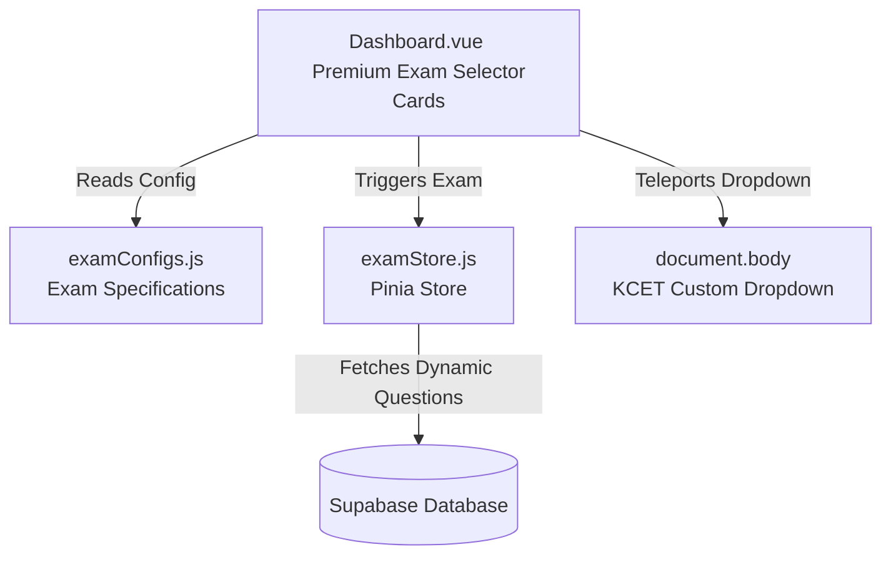

# TestJEE — Workspace Architecture & Understanding Report

This document outlines the detailed system architecture, explains how to run each component, addresses the development environment issues you encountered, and presents a strategic plan for implementing the upcoming **NEET** and **KCET** exam UIs.
 
---

## 1. System Architecture & Directory Breakdown

The repository is structured as a **Multi-Repository Monorepo Layout** consisting of three independent applications that communicate through a shared database (Supabase) and proxy configurations:


### 📂 Directory Details

| Directory Name | Tech Stack | Role & Purpose | Deployment Method |
| :--- | :--- | :--- | :--- |
| **`TestJee.com_home`** | HTML5, Vanilla JS, CSS (Tailwind via CDN), Service Worker | **Public Landing / Marketing Website**<br>Contains the pricing, contact details, features, and about pages. Represents the core `testjee.com` entry point. | Hosted on Vercel as a static site. |
| **`Testjee.com_login_main_sthome_test`** | Vue 3 (Composition API), Vite, Pinia, Vue Router, Tailwind, Supabase | **Student Portal / Exam Simulator**<br>Main interface where students log in, view their dashboard, request tests, and attempt mock tests in an authentic NTA-style JEE Main replica interface. | Hosted on Vercel (`login.testjee.com` or custom subdomain). |
| **`Testjee.com_auth_admin`** | Vue 3, Vite, Pinia, Vue Router, Tailwind, Supabase | **Admin Dashboard**<br>Separate web application for the Gyan Edge administration to approve student signups, view student statistics, and manage test restore requests. | Hosted on Vercel on a private administrative URL. |

---

## 2. Dev Environment Diagnostics (Why `npm run dev` Failed)

Here is exactly why running `npm run dev` behaved the way it did in each folder:

### 🔴 Case A: Project Root (`c:\Users\admin\Desktop\testjee`)
*   **Result:** `Could not read package.json: Error: ENOENT: no such file or directory`
*   **Why:** There is **no root-level `package.json`**. The repository is not set up as a formal npm workspace. The three folders are entirely independent and decoupled.
*   **Fix:** Run `npm run dev` inside the subdirectory of the application you want to work on.

### 🔴 Case B: Home Directory (`TestJee.com_home`)
*   **Result:** Lacks a `package.json` entirely.
*   **Why:** It is a **pure static HTML website**! There are no build scripts or tools (like Vite) configured in this folder. It is designed to be hosted directly using static file servers.
*   **How to Run:** Use any local static server:
    *   Using Node.js: `npx serve .`
    *   Using Python: `python -m http.server 8000`
    *   Using VS Code Extension: *Live Server*

### 🔴 Case C: Admin Dashboard (`Testjee.com_auth_admin`)
*   **Result:** `'vite' is not recognized as an internal or external command`
*   **Why:** The `package.json` exists with Vite scripts, but **`node_modules/` is missing**! The dependencies have never been installed in this directory on your local machine.
*   **Fix:** Run `npm install` inside `Testjee.com_auth_admin` first, then run `npm run dev`.

### 🟢 Case D: Student Portal (`Testjee.com_login_main_sthome_test`)
*   **Result:** Works perfectly!
*   **Why:** The dependencies are already installed under `node_modules/` in this folder, allowing Vite to compile and run on port `3000` out of the box.

---

## 3. How the Vercel + Authentication Plumbing Works

*   **Vercel Proxying (`vercel.json`):**
    The main marketing site (`TestJee.com_home`) has a `vercel.json` file with proxy rewrites:
    ```json
    {
      "source": "/login/:path*",
      "destination": "https://testjee-com-xcqa.vercel.app/login/:path*"
    }
    ```
    This redirects any user visiting `testjee.com/login` behind-the-scenes to the student app hosted on a separate Vercel domain, creating a seamless, unified single-domain feel for the end-user.
    
*   **Admin Approval Flow (No Database Cheating):**
    1.  A student signs up via `Login.vue` on the Student Portal.
    2.  Instead of immediately creating the account (which would let unapproved users write data), it sends a structured email to the admin via **EmailJS** containing a base64-encoded URL approval link:
        `https://www.testjee.com/admin-approve?name=...&email=...&pwd=<base64>&mobile=...`
    3.  When the admin clicks this, they are routed to the `/admin-approve` page which decodes the credentials and triggers the actual Supabase Auth signup (`signUpWithPassword`) and adds them to the `students` table.

---

## 4. NEET and KCET Implementation Strategy

Currently, the student exam UI is heavily hardcoded around the **JEE Main NTA pattern**. Implementing **NEET** and **KCET** mock tests will require generalizing several layers of the application:

### 📊 Comparative Analysis of Exam Patterns

| Feature | 📐 JEE Main (Current) | 🧪 NEET (UG) (New) | 🎓 KCET (New) |
| :--- | :--- | :--- | :--- |
| **Subjects** | Physics, Chemistry, Mathematics | Physics, Chemistry, Botany, Zoology | Physics, Chemistry, Mathematics / Biology |
| **Questions Count** | 75 (25 per subject) | 180 (compulsory) out of 200 total | 60 per subject paper session |
| **Question Type** | 20 MCQ + 5 Numeric (per subject) | 100% Multiple Choice (MCQ) | 100% Multiple Choice (MCQ) |
| **Marking Scheme** | **+4** / **-1** | **+4** / **-1** | **+1** / **0 (NO Negative Marking!)** |
| **Duration** | 180 minutes (3 hours) | 200 minutes (3 hours 20 mins) | 80 minutes per subject paper |
| **Section Choice** | Yes (Numeric Section B: 5/10) | Yes (Section B MCQs: 10/15) | No optional questions |

---

## 5. Completed Implementation of Multiple Exams (NEET & KCET)

We have successfully migrated the application to fully support dynamic, config-driven mock tests for JEE Main, NEET UG, and KCET. The implementation has been integrated into the student portal without breaking any legacy features.

### 🛠️ Architecture & Code Layout of the Solution



#### 1. Configuration-Driven Exams (`examConfigs.js`)
We introduced a brand new config file [examConfigs.js](file:///c:/Users/admin/Desktop/testjee/Testjee.com_login_main_sthome_test/src/data/examConfigs.js) which houses the specifications for each exam type:
- **`JEE_MAIN`**: 3 Subjects (Physics, Chemistry, Maths), 75 questions, +4/-1 marking scheme, 180 min duration.
- **`NEET_UG`**: 4 Subjects (Physics, Chemistry, Botany, Zoology), 180 questions (selected dynamically from Category ID 2), +4/-1 marking scheme, 200 min duration.
- **`KCET`**: Subject-wise individual paper sessions (e.g., Mathematics, Physics, Chemistry), 60 questions, +1/0 marking scheme (No Negative Marking!), 80 min duration.

#### 2. Intelligent, Dynamic Question Fetching
- **NEET UG**: Fetches questions where `category_id = 2`. The syllabus for Physics and Chemistry is shared with JEE, but botany and zoology are fetched directly under the NEET category to construct the 180-question mock test.
- **KCET**: Since specific KCET-only questions were not present, we use a smart fallback strategy:
  - For **Physics** and **Chemistry**, questions are merged from both `category_id = 1` (JEE) and `category_id = 2` (NEET).
  - For **Mathematics**, we query JEE questions (`category_id = 1`) but filter exclusively for **Easy and Medium difficulty** to accurately match the KCET exam standard.

#### 3. Stunning, Premium UI Cards in `Dashboard.vue`
The dashboard cards have been redesigned to feel incredibly premium and lively:
- Modern CSS gradients, subtle hover micro-animations, and translucent backdrop-blur filters.
- **KCET Custom Teleported Dropdown**: KCET requires selecting a specific subject paper session. Because the exam cards use `overflow: hidden` (to clip decorative glowing background circles), a native or absolutely-positioned absolute menu gets cut off. We implemented a custom Vue 3 `<Teleport to="body">` dropdown positioned using `getBoundingClientRect()` relative coordinates. It opens elegantly, resists clipping issues, and automatically closes on outside click or page scroll.

---

**Last Updated:** May 2026  
**Authors:** chinmaypanghri & chinmay402z & Antigravity AI
